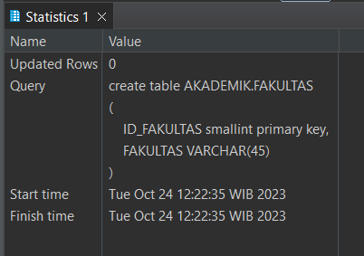
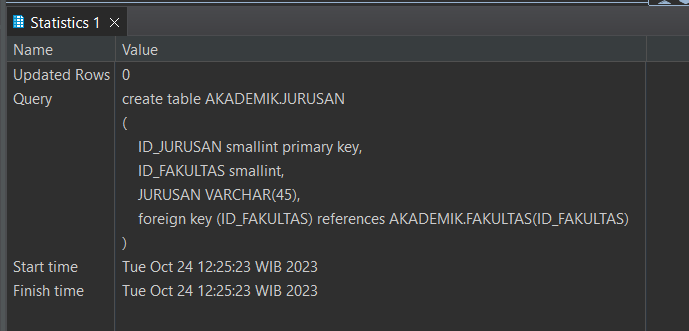
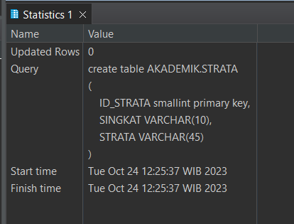
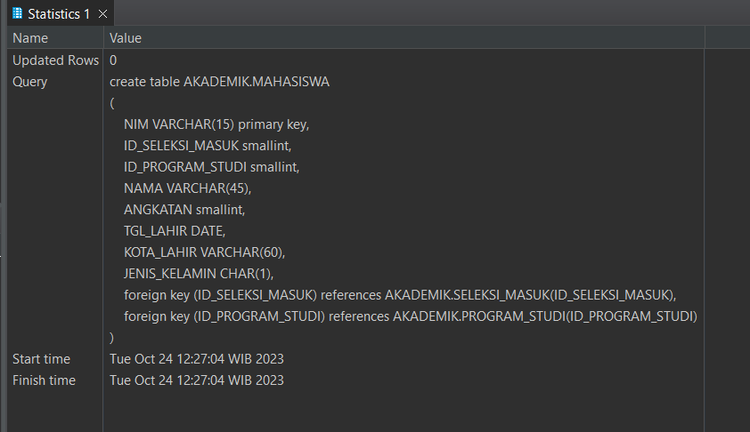
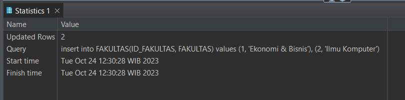
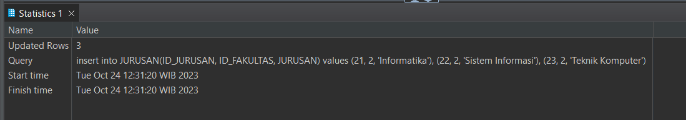
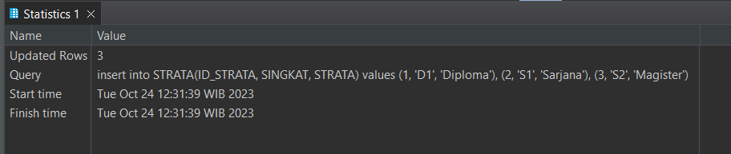
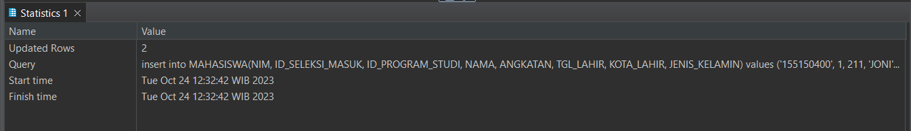

# 💻 Tugas 3 Praktikum : SQL Data Manipulation Language

> "The SQL Data Manipulation Language (DML) specifies how data is inserted, updated, retrieved, and deleted in the objects defined using the Data Definition Language (DDL)." - Tiffany, R. (2003). Data Manipulation Language. https://doi.org/10.1007/978-1-4302-0785-6_6

Berikut merupakan langkah pengerjaan praktikum serta hasil screenshot pengerjaan praktikum Modul 3

## 🚶‍♂️ Langkah Pengerjaan

Langkah pengerjaan saya bagi menjadi 2 bagian yaitu Data Definition dan Data Manipulation. Data Definition berisi `create schema` dan `create table`, sedangkan Data Manipulation berisi `use schema` dan `insert into`.

### A. Data Definition 
1. Execute SQL Script
    Pada langkah-langkah selanjutnya, saya akan me-select / mem-blok baris script yang ingin saya jalankan, kemudian mengklik "Execute SQL Script"
    

2. Membuat schema AKADEMIK
    ```
    create schema AKADEMIK;
    ```

    

3. Membuat tabel FAKULTAS
    ```
    create table AKADEMIK.FAKULTAS
    (
	ID_FAKULTAS smallint primary key,
	FAKULTAS VARCHAR(45)
    )
    ```
    

4. Membuat tabel JURUSAN
    ```
    create table AKADEMIK.JURUSAN
    (
	ID_JURUSAN smallint primary key,
	ID_FAKULTAS smallint,
	JURUSAN VARCHAR(45),
	foreign key (ID_FAKULTAS) references AKADEMIK.FAKULTAS(ID_FAKULTAS)
    )
    ```

    

5. Membuat tabel STRATA
    ```
    create table AKADEMIK.STRATA
    (
	ID_STRATA smallint primary key,
	SINGKAT VARCHAR(10),
	STRATA VARCHAR(45)
    )
    ```

    

6. Membuat tabel PROGRAM_STUDI
    ```
    create table AKADEMIK.PROGRAM_STUDI
    (
	ID_PROGRAM_STUDI smallint primary key,
	ID_STRATA smallint,
	ID_JURUSAN smallint,
	PROGRAM_STUDI VARCHAR(60),
	foreign key (ID_STRATA) references AKADEMIK.STRATA(ID_STRATA),
	foreign key (ID_JURUSAN) references AKADEMIK.JURUSAN(ID_JURUSAN)
    )
    ```

    

7. Membuat tabel SELEKSI_MASUK
    ```
    create table AKADEMIK.SELEKSI_MASUK
    (
	ID_SELEKSI_MASUK smallint primary key,
	SINGKAT VARCHAR(12),
	SELEKSI_MASUK VARCHAR(60)
    )
    ```

    

8. Membuat tabel MAHASISWA
    ```
    create table AKADEMIK.MAHASISWA
    (
	NIM VARCHAR(15) primary key,
	ID_SELEKSI_MASUK smallint,
	ID_PROGRAM_STUDI smallint,
	NAMA VARCHAR(45),
	ANGKATAN smallint,
	TGL_LAHIR DATE,
	KOTA_LAHIR VARCHAR(60),
	JENIS_KELAMIN CHAR(1),
	foreign key (ID_SELEKSI_MASUK) references AKADEMIK.SELEKSI_MASUK(ID_SELEKSI_MASUK),
	foreign key (ID_PROGRAM_STUDI) references AKADEMIK.PROGRAM_STUDI(ID_PROGRAM_STUDI)
    )
    ```

    

### B. Data Manipulation 
1. Run script "use AKADEMIK"
    
    untuk mengaktifkan schema AKADEMIK sebagai schema tujuan untuk tahapan `insert` berikut nya, saya run script berikut:
    ```
    use AKADEMIK;
    ```

    

2. Insert into FAKULTAS

    Tahapan ini hingga insert-insert yang selanjutnya saya atur urutannya sedemikian rupa agar semua dependency foreign key sudah terpenuhi sebelum insert suatu table dijalankan. Sehingga Langkah 2 - 7 dapat dijalankan secara urut tanpa ada error.
    ```
    insert into FAKULTAS(ID_FAKULTAS, FAKULTAS) values (1, 'Ekonomi & Bisnis'), (2, 'Ilmu Komputer');
    ```

    

3. Insert into JURUSAN
    ```
    insert into JURUSAN(ID_JURUSAN, ID_FAKULTAS, JURUSAN) values (21, 2, 'Informatika'), (22, 2, 'Sistem Informasi'), (23, 2, 'Teknik Komputer');
    ```

    

4. Insert into STRATA
    ```
    insert into STRATA(ID_STRATA, SINGKAT, STRATA) values (1, 'D1', 'Diploma'), (2, 'S1', 'Sarjana'), (3, 'S2', 'Magister');
    ```

    

5. Insert into PROGRAM_STUDI
    ```
    insert into PROGRAM_STUDI(ID_PROGRAM_STUDI, ID_STRATA, ID_JURUSAN, PROGRAM_STUDI) values (211, 2, 21, 'Teknik Informatika'), (212, 2, 21, 'Teknik Komputer'), (219, 3, 21, 'Magister Ilmu Komputer');
    ```

    

6. Insert into SELEKSI_MASUK
    ```
    insert into SELEKSI_MASUK(ID_SELEKSI_MASUK, SINGKAT, SELEKSI_MASUK) values (1, 'SNMPTN', 'SELEKSI NASIONAL MAHASISWA PERGURUAN TINGGI NEGERI'), (2, 'SBMPTN', 'SELEKSI BERSAMA MAHASISWA PERGURUAN TINGGI NEGERI');
    ```

    

7. Insert into MAHASISWA

    Aturan untuk melakukan `insert` pada kolom dengan tipe data `DATE` adalah dengan mengisi `String` dengan format 'YYYY-MM-DD' sehingga 2 Oktober 1997 akan dimasukkan sebagai '1997-10-02'
    ```
    insert into MAHASISWA(NIM, ID_SELEKSI_MASUK, ID_PROGRAM_STUDI, NAMA, ANGKATAN, TGL_LAHIR, KOTA_LAHIR, JENIS_KELAMIN) values ('155150400', 1, 211, 'JONI', 2015, '1997-01-01', 'Malang', 'W'), ('155150401', 2, 212, 'JONO', 2015, '1997-10-02', 'Situbondo', 'P');
    ```

    
