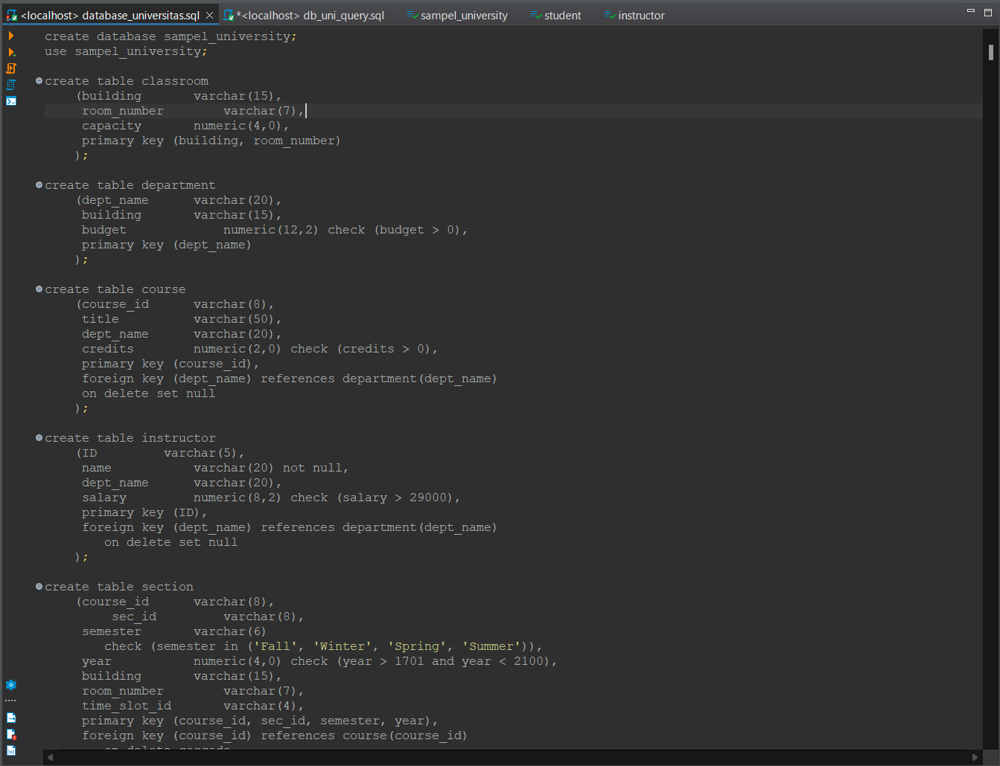
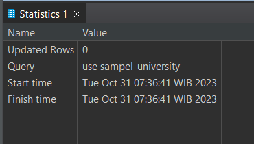
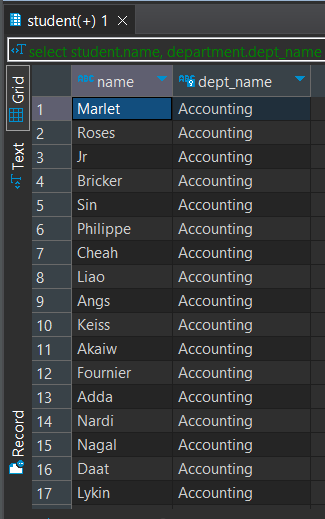
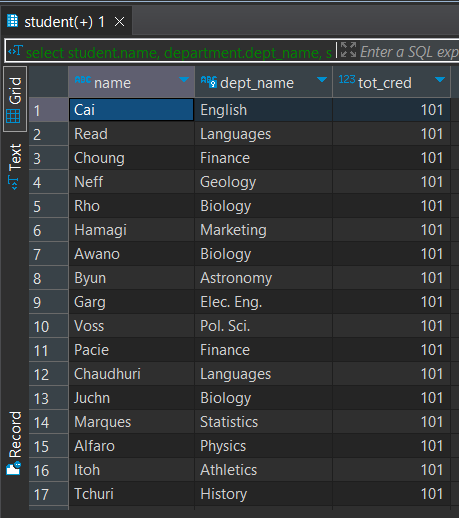
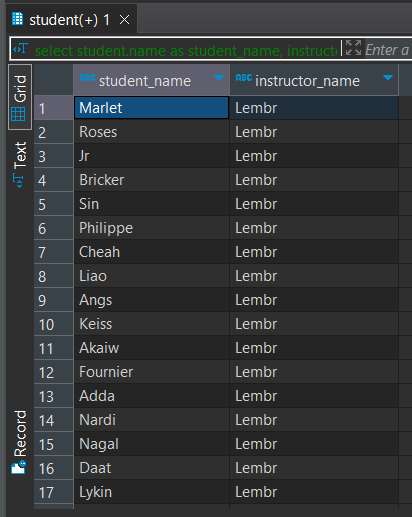

# 💻 Tugas 4 Praktikum : SQL Join

> "SQL Join is an operation in accessing the data from table if number of tables exceeds one."
Bhanuprakash, C. (2014). A simple approach to SQL joins in a relational algebraic notation. https://doi.org/10.5120/18190-9099 

Berikut merupakan langkah pengerjaan praktikum serta hasil screenshot pengerjaan praktikum Modul 8

## 🚶‍♂️ Langkah Pengerjaan

### Sebelum Mengerjakan Soal:
1.  Saya mendownload `database_universitas.sql` dan execute script dan menunggu 34 ribu baris insert selesai dijalankan.
    ```
    create database sampel_university;
    use sampel_university;

    create table classroom
	(building		varchar(15),
	 room_number		varchar(7),
	 capacity		numeric(4,0),
	 primary key (building, room_number)
	);

    dst.
    ```
    

2.  Saya menggunakan sintaks `use` untuk memberitahu DBMS bahwa saya ingin untuk meng query schema `sampel_university`

    ```
    use sampel_university;
    ```

    


### Soal:

1.  Tampilkan semua nama Mahasiswa beserta nama department.
    ```
    select student.name, department.dept_name
    from student
    join department
    on student.dept_name = department.dept_name;
    ```
    

2.  Tampilkan semua nama student beserta nama department yang memiliki total SKS (total credit) lebih dari 100.
    ```
    select student.name, department.dept_name, student.tot_cred
    from student 
    join department
    on student.dept_name = department.dept_name
    where student.tot_cred > 100
    order by student.tot_cred asc;
    ```
    

3.  Tampilkan nama student dan nama instructor yang bekerja pada department yang sama
    ```
    select student.name as student_name, instructor.name as instructor_name
    from student
    join instructor
    on student.dept_name = instructor.dept_name;
    ```
    
