# 💻 Tugas 5 Praktikum : Scalar & Aggregate Functions in SQL

> "A <b>Scalar Function</b> can be used in SQL queries wherever an expression can be used. Typical scalar functions are arithmetic functions like + and * or concat for string concatenation. By contrast, an <b>Aggregate Function</b> is applied to the values of a single column of either a group of rows or of all rows of an input table. A group of rows occurs if a GROUP-BY clause is used. " <br> <b>Jaedicke, M., &amp; Mitschang, B. (1998).</b> On parallel processing of aggregate and scalar functions in object-relational DBMS. ACM SIGMOD Record, 27(2), 379–389. <br> https://doi.org/10.1145/276305.276338 

Berikut merupakan langkah pengerjaan praktikum serta hasil screenshot pengerjaan praktikum Modul Fungsi Skalar dan Fungsi Agregasi.

## 🚶‍♂️ Langkah Pengerjaan

### Sebelum Mengerjakan Soal:
1.  Saya mendownload `database_universitas.sql` dan execute script dan menunggu 34 ribu baris insert selesai dijalankan. Proses ini memakan waktu 50 detik.
    ```
    create database sampel_university;
    use sampel_university;

    create table classroom
	(building		varchar(15),
	 room_number		varchar(7),
	 capacity		numeric(4,0),
	 primary key (building, room_number)
	);

    dst.
    ```
    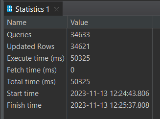

2.  Saya menggunakan sintaks `use` untuk memberitahu DBMS bahwa saya ingin untuk meng query schema `sampel_university`

    ```
    use sampel_university;
    ```

    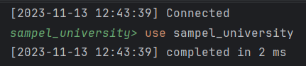


### 📐 Fungsi Skalar

1.  Concat
    ```
    select concat(i.name, " has a salary of ", i.salary) 'salary' from sampel_university.instructor i;
    ```
    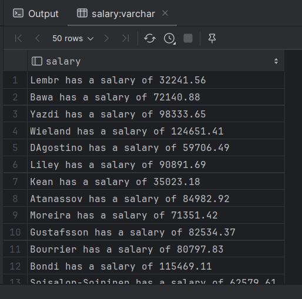

2.  Substring index
    ```
    select substring_index(i.dept_name, ' ', 1) "First word of dept_name" from sampel_university.instructor i;
    ```
    

3.  Substring
    ```
    select distinct substr(s.dept_name, 2) from sampel_university.student s;
    ```
    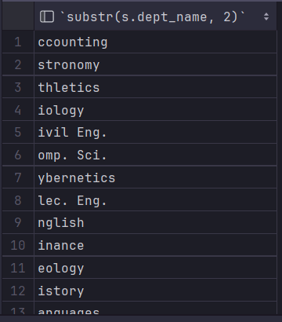

4.  Length
    ```
    select distinct length(s.dept_name) from sampel_university.student s;
    ```
    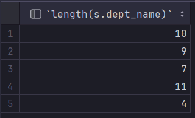

5.  Replace
    ```
    select distinct replace(s.dept_name, ' ', "[tadinya space]") from sampel_university.student s;
    ```
    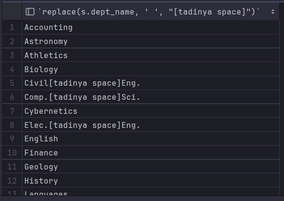

6.  Trim
    ```
    select trim("     Trim me       ") "trimmed";
    ```
    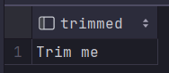

7.  Upper
    ```
    select distinct upper(s.dept_name) "All Caps" from sampel_university.student s;
    ```
    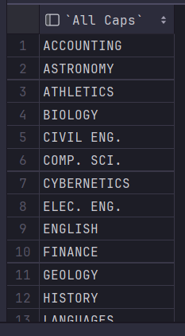

8.  Lower
    ```
    
    ```
    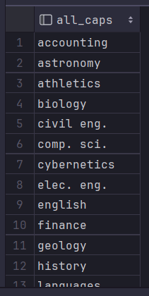


### 🔗 Fungsi Agregasi

1.  SUM
    ```
    select i.dept_name, sum(i.salary) "Salary Sum" from sampel_university.instructor i group by i.dept_name;
    ```
    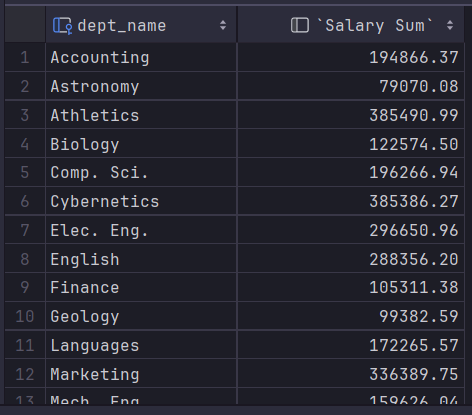

2.  COUNT
    ```
    select count(c.course_id) "Jumlah course yang ada" from sampel_university.course c;
    ```
    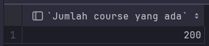

3.  AVG
    ```
    select i.dept_name, avg(i.salary) 'avg salary' from sampel_university.instructor i group by i.dept_name;
    ```
    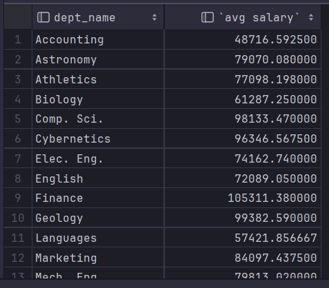

4.  MIN
    ```
    select i.name, min(i.salary) from sampel_university.instructor i;
    ```
    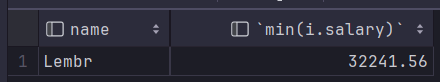

5.  MAX
    ```
    select c.title, max(c.credits) from sampel_university.course c;
    ```
    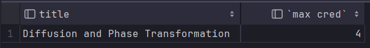