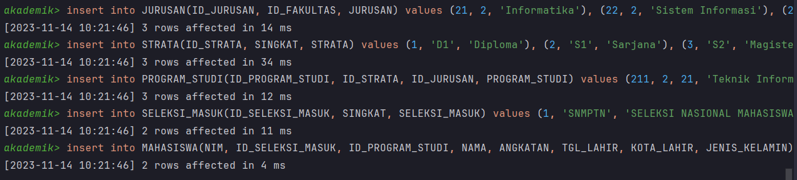
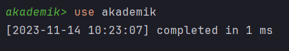
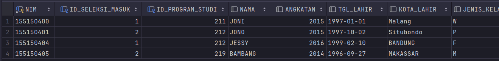
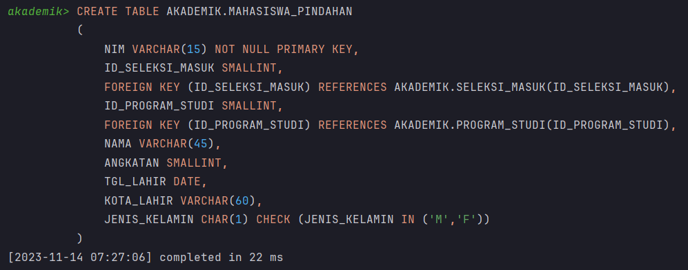
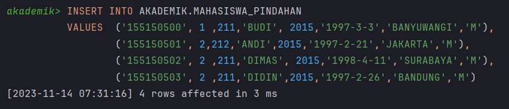
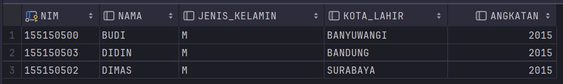
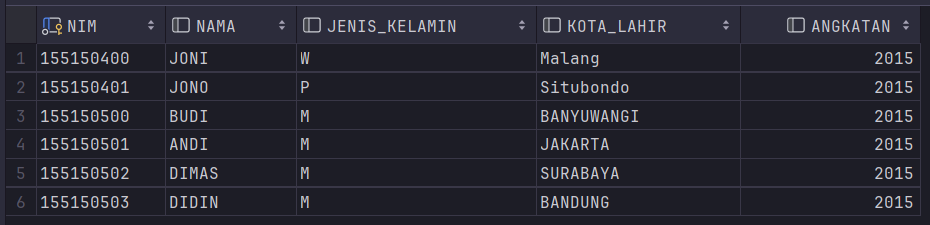
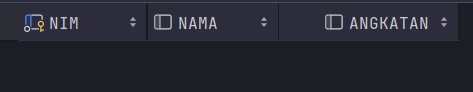
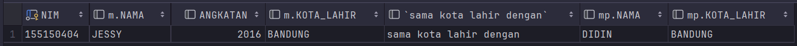

# 💻 Tugas 6 Praktikum : Union & Subquery in SQL

> "Let relations r1 and r2 be of the same type; then their <b>union</b>, r1 `union` r2, is a relation of the same type, with body consisting of all tuples t such that t appears in both r1 or r2 or both.<br> A <b>subquery</b> is a `select` expression enclosed in parentheses, but a `select` expression enclosed in parentheses isn't necessarily a subquery."<br><b>Date, C.J. (2011).</b> <i>SQL and Relational Theory: How to Write Accurate SQL Code</i><br>https://books.google.co.id/books?id=WuZGD5tBfMwC

Berikut merupakan langkah pengerjaan praktikum serta hasil screenshot pengerjaan praktikum Union & Subquery pada SQL.

## 🚶‍♂️ Langkah Pengerjaan

### Sebelum Mengerjakan Soal:
1.  Saya mendownload `Akademik.sql` dan execute script dan menunggu proses insert selesai dijalankan.
    ```
    create schema AKADEMIK;

    create table AKADEMIK.FAKULTAS
    (
        ID_FAKULTAS smallint primary key,
        FAKULTAS VARCHAR(45)
    );
    ```

    

2.  Saya menggunakan sintaks `use` untuk memberitahu RDBMS bahwa saya ingin untuk meng query schema `AKADEMIK`

    ```
    use akademik;
    ```

    


### 📐 Latihan 1

1.  Lakukan perintah Insert untuk menambahkan data pada table Mahasiswa
    ```
    INSERT INTO akademik.mahasiswa values('155150404', 1, 212,'JESSY',2016,'1999-2-10','BANDUNG','F'),('155150405', 2 ,219,'BAMBANG',2014,'1996-9-27','MAKASSAR','M');

    ```
    

2.  Lakukan perintah DDL untuk membuat sebuah table baru Mahasiswa_Pindahan
    ```
    CREATE TABLE AKADEMIK.MAHASISWA_PINDAHAN
    (
    NIM VARCHAR(15) NOT NULL PRIMARY KEY,
    ID_SELEKSI_MASUK SMALLINT,
    FOREIGN KEY (ID_SELEKSI_MASUK) REFERENCES AKADEMIK.SELEKSI_MASUK(ID_SELEKSI_MASUK),
    ID_PROGRAM_STUDI SMALLINT,
    FOREIGN KEY (ID_PROGRAM_STUDI) REFERENCES AKADEMIK.PROGRAM_STUDI(ID_PROGRAM_STUDI),
    NAMA VARCHAR(45),
    ANGKATAN SMALLINT,
    TGL_LAHIR DATE,
    KOTA_LAHIR VARCHAR(60),
    JENIS_KELAMIN CHAR(1) CHECK (JENIS_KELAMIN IN ('M','F'))
    );
    ```
    

3.  Lakukan perintah Insert untuk menambahkan data pada table Mahasiswa_Pindahan
    ```
    INSERT INTO AKADEMIK.MAHASISWA_PINDAHAN
    VALUES  ('155150500', 1 ,211,'BUDI', 2015,'1997-3-3','BANYUWANGI','M'),
            ('155150501', 2,212,'ANDI',2015,'1997-2-21','JAKARTA','M'),
            ('155150502', 2 ,211,'DIMAS', 2015,'1998-4-11','SURABAYA','M'),
            ('155150503', 2 ,211,'DIDIN',2015,'1997-2-26','BANDUNG','M');
    ```
    

4.  Tampilkan NIM, NAMA, JENIS_KELAMIN, KOTA LAHIR dan ANGKATAN dari Mahasiswa yang memiliki Kota Lahir dengan inisial B dan dari Mahasiswa_Pindahan yang memiliki Nama dengan inisial D. Urutkan berdasarkan NIM.
    ```
    select mp.NIM, mp.NAMA, mp.JENIS_KELAMIN, mp.KOTA_LAHIR, mp.ANGKATAN
    from(
        select *
            from AKADEMIK.MAHASISWA_PINDAHAN mp1
            where substr(mp1.KOTA_LAHIR, 1, 1) = 'B'
        union
        select *
            from AKADEMIK.MAHASISWA_PINDAHAN mp2
            where substr(mp2.NAMA, 1, 1) = 'D'
    ) mp;
    ```
    

5.  Tampilkan NIM, NAMA, JENIS_KELAMIN, KOTA LAHIR dan ANGKATAN dari Mahasiswa Angkatan 2015 dan dari Mahasiswa_Pindahan tetapi kecuali Mahasiswa_Pindahan yang memiliki Kota Lahir dengan inisial M urutkan berdasarkan NIM.
    ```
    select data.NIM, data.NAMA, data.JENIS_KELAMIN, data.KOTA_LAHIR, data.ANGKATAN
    from(
        select * from AKADEMIK.mahasiswa m1
            where m1.ANGKATAN = 2015
        union
        select *
        from(
            select * from AKADEMIK.MAHASISWA_PINDAHAN mpz
            except
            select * from AKADEMIK.MAHASISWA_PINDAHAN mp
                     where substr(mp.KOTA_LAHIR, 1, 1) = 'M'
        ) mp_tanpa_inisial_m
    ) data;
    ```
    


### 🔗 Latihan 2

1.  Tampilkan NIM, Nama dan Angkatan dari Mahasiswa yang memiliki Kota Lahir yang sama dengan Mahasiswa Pindahan dengan nama BUDI
    ```
    select m.NIM, m.NAMA, m.ANGKATAN from AKADEMIK.mahasiswa m, (
        select * from akademik.mahasiswa_pindahan mp where mp.NAMA like "%budi%"
    ) mp_budi
    where m.KOTA_LAHIR = mp_budi.KOTA_LAHIR;
    ```
    

2.  Tampilkan NIM, Nama dan Angkatan dari Mahasiswa yang memiliki Kota Lahir yang sama dengan seluruh Mahasiswa Pindahan
    ```
    select m.NIM, m.NAMA, m.ANGKATAN, m.KOTA_LAHIR, "sama kota lahir dengan", mp.NAMA, mp.KOTA_LAHIR
    from AKADEMIK.mahasiswa m, (
        select * from AKADEMIK.mahasiswa_pindahan
    ) mp
    where m.KOTA_LAHIR = mp.KOTA_LAHIR;
    ```
    
